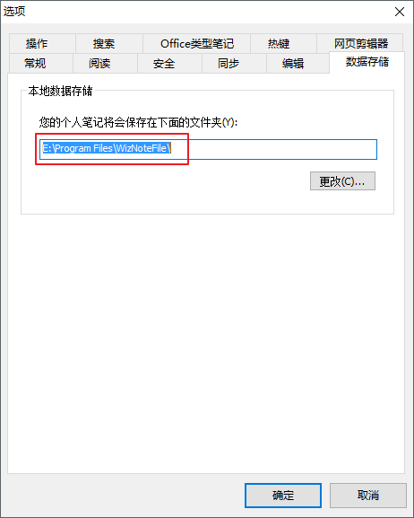
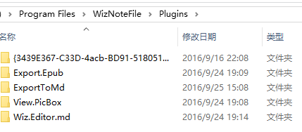
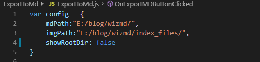

为知笔记导出MarkDown插件，只支持MarkDown格式文档导出。

### 步骤
1.克隆项目到本地

2.复制ExportToMd文件夹到数据`存储目录`下的Plugins目录中

3.配置导出的markdown文件和图片目录路径参数

4.重新启动程序

5.导出文档

### 日志
[2019-09-01]
- 新增支持markdown的updated标签
- 新增支持多级目录，删除showRootDir配置项
- 新增tags和categories各项之间使用", "间隔，更加美观
- 新增配置项useEditorMd支持使用`Wiz.Editor.md插件`将html转为markdown
- 支持群组笔记(当`ExportToMd.js`中的`useEditorMd: false`不支持)
- 新增配置项saveImgMdName支持保存图片到与markdown同名的目录
- 新增配置项saveAccordingMdCategories支持根据为知笔记Markdown中的位置保存笔记

[2018-07-10]
- 新增配置项showRootDir导出标签categories是否为文件路径根目录
- 维持原生语法`---`配置标签
- cover支持粘贴图片并导出为相对路径，配合插件[hexo-image-cdn](https://github.com/lzuliuyun/hexo-image-cdn)使用更好哦

[2018-04-12]
- 自定义`!---`前后包裹语法导出配置到头部

[2017-03-19]
- 更新支持为知笔记4.5以上版本