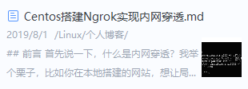

声明：该脚本主要参考了[ExportToMd](https://github.com/lzuliuyun/ExportToMd) 和 [Wiz.Editor.md](https://github.com/akof1314/Wiz.Editor.md)

为知笔记导出MarkDown插件，只支持MarkDown格式文档导出。

### 亮点
- 默认根据Markdown文件在为知笔记中的位置建立文件夹，并保存笔记
- 默认导出的根目录为`E:/blog/wizmd/`
- 默认保存图片到与markdown文件同名的文件夹
- 默认添加hexo博客所需要的头部标签信息

### 步骤
1.克隆项目到本地

2.复制ExportToMd文件夹到数据`存储目录`下的Plugins目录中

3.配置导出的路径参数以及其他自定义参数，默认路径为`E:/blog/wizmd/`。具体参数含义请看 ExportToMd.js 头部声明

4.重新启动程序

5.导出文档

6.导出结果展示

例如，当我有一篇笔记放在了为知笔记的`Kit`目录，名字为`双电脑、双显示屏工作环境搭建.md`，如下所示：

还有一篇笔记放在了为知笔记的`Linux`根目录下的`个人博客`子目录，名字为`Centos搭建Frp实现内网穿透.md`，如下所示：

采用该插件，默认参数导出的结果如下：

以`双电脑、双显示屏工作环境搭建.md`为例，该markdown文件的头部如下所示，也就是适配了hexo博客的标签信息。

以`双电脑、双显示屏工作环境搭建.md`为例，该markdown文件的图片引用格式如下所示：

### 日志
[2019-09-01]
- 新增支持markdown的updated标签
- 新增支持多级目录，删除showRootDir配置项
- 新增tags和categories各项之间使用", "间隔，更加美观
- 新增配置项useEditorMd支持使用`Wiz.Editor.md插件`将html转为markdown
- 支持群组笔记(当`ExportToMd.js`中的`useEditorMd: false`不支持)
- 新增配置项saveImgMdName支持保存图片到与markdown文件同名的文件夹
- 新增配置项saveAccordingMdCategories支持根据Markdown文件在为知笔记中的位置建立文件夹，并保存笔记

[2018-07-10]
- 新增配置项showRootDir导出标签categories是否为文件路径根目录
- 维持原生语法`---`配置标签
- cover支持粘贴图片并导出为相对路径，配合插件[hexo-image-cdn](https://github.com/lzuliuyun/hexo-image-cdn)使用更好哦

[2018-04-12]
- 自定义`!---`前后包裹语法导出配置到头部

[2017-03-19]
- 更新支持为知笔记4.5以上版本