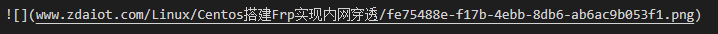
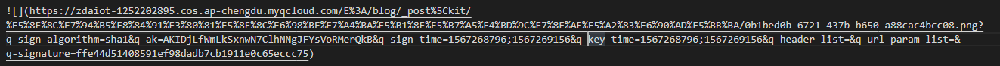

最近一直考虑迁移为知笔记到hexo博客中，今天写了一个简单的脚本帮助我完成迁移任务。

## 依赖环境
### 程序运行依赖
- Python3
- 若使用腾讯云存储，需要依赖 cos-python-sdk-v5

### 使用过程依赖
- [windows版本的为知笔记](http://url.wiz.cn/u/windows)
- [为知笔记ExportToMd插件](https://github.com/lzuliuyun/ExportToMd)
- [为知笔记Wiz.Editor.md插件](https://github.com/akof1314/Wiz.Editor.md)

## wiznote2hexo函数
### 功能
- 将为知笔记markdown文件中的图片路径`index_files`全部替换为markdown文件名，并将`index_files`文件夹重命名为markdown文件名。
- 该方法适用于将手动从为知笔记导出的笔记转为hexo格式的笔记。

### 亮点
- 支持一行有多张图片
- 支持检测只在markdown引用，但是不在`index_files`文件夹中的图片
- 支持html格式的图片，例如``
- 支持添加hexo markdown 头部的一系列标签，若要自定义，请更改`wiznote2hexo.py`文件`wiznote2hexo`函数中`head`变量

### 使用方法
首先，打开为知笔记软件。找到要上传到hexo的笔记，例如`Centos搭建Frp实现内网穿透.md`，右击为知笔记第二栏中的笔记，选择`高级->用资源管理器打开`。

右击资源管理器中的笔记，使用压缩软件打开，然后解压到某一个路径，例如`E:\test`。得到的文件如下:


但是需要注意的是，为知笔记的存储格式为html格式，而非markdown格式。所以我们需要在与`index_files`相同的路径下新建`Centos搭建Frp实现内网穿透.md`。在为知笔记中，使用`Wiz.Editor.md插件`编辑，然后复制所有内容到新建的`Centos搭建Frp实现内网穿透.md`中。

接着，运行程序，这里我们解压到了`E:\test\Centos搭建Frp实现内网穿透.md`路径，需要注意，这里的`Centos搭建Frp实现内网穿透.md`为文件夹名称。
```
python wiznote2hexo2csdn.py --mode=wiznote2hexo --path=E:\test\Centos搭建Frp实现内网穿透.md --mdfile_name=Centos搭建Frp实现内网穿透.md
```

转换之后，得到的文件如下所示：


markdown文件头部如下所示：


需要手动补充上述的标签，例如`date:`等。

此时，`Centos搭建Frp实现内网穿透`文件夹和`Centos搭建Frp实现内网穿透.md`满足了hexo博客的要求。

## md2hexo函数
### 功能
- 将一个Markown文件中的图片路径更改为markdown文件名；建立以为markdown文件名命名的文件夹，并将该Markdown的所有图片移动到该文件夹。
- 根据markdown文件中的 categories 建立文件夹，并将更改后的markdown文件和图片文件夹移动到该文件夹。
- 该方法适用于 https://github.com/lzuliuyun/ExportToMd 从为知笔记导出的笔记转为hexo格式的笔记。

### 亮点
- 支持一行有多张图片
- 支持检测只在markdown引用，但是不在图片文件夹中的图片
- 支持html格式的图片，例如``
- 可根据markdown文件中的 categories 建立文件夹，将markdown以及图片文件夹迁移过去

### 使用方法
首先，打开为知笔记软件。找到要上传到hexo的笔记，例如`Centos搭建Frp实现内网穿透.md`，使用`ExportToMd插件`导出该markdown文件。

> 该`ExportToMd插件`是来自[这里](https://github.com/lzuliuyun/ExportToMd)，我这里稍微改了一下，适配自己的需求，所以放在了我自己的github的仓库。具体配置可以看[这里](ExportToMd/README.md)，我这里配置的路径为`mdPath:"E:/blog/wizmd/", imgPath:"E:/blog/wizmd/index_files/",`。注意这些文件夹要自己新建，否则无法保存成功。

导出之后，得到的文件如下所示：


markdown文件头部如下所示：


可以看到该插件可以自动帮我们加上hexo markdown的标签，省去了我们很多麻烦。但是不支持添加更新时间，这个需要更新插件，之后会考虑更新。

> 若有的时候，导出的文档有乱码，那么我们最好使用`Wiz.Editor.md插件`编辑，然后复制所有内容到markdown文件中。

接着，运行程序，我这里的要保存的Markdown路径为`E:/blog/_posts`。注意`path`和`save_path`参数结尾是否添加`/`要保持一致，均不加。
```
python wiznote2hexo2csdn.py --mode=md2hexo --path=E:/blog/wizmd/ --pic_ori_path=index_files --mdfile_path_name=E:/blog/wizmd/Centos搭建Frp实现内网穿透.md --save_path=E:/blog/_posts
```

转换之后，得到的文件如下所示，可以看到我们根据markdown文件中的 categories 建立文件夹，并将更改后的markdown文件和图片文件夹移动到了该文件夹。


转换之后，`Centos搭建Frp实现内网穿透.md`文件中图片如下所示，可以看出来已经采用了hexo markdown格式的引用格式


此时，`E:/blog/_posts`文件夹下的内容满足了hexo博客的要求。

## markdown2hexo函数
和 md2hexo函数 不同点在于该函数支持多个markdown文件的转换。

### 功能
- 将一个文件夹下的所有Markown文件中的图片路径更改为markdown文件名；建立以为markdown文件名命名的文件夹，并将该Markdown的所有图片移动到该文件夹。
- 根据markdown文件中的 categories 建立文件夹，并将更改后的markdown文件和图片文件夹移动到该文件夹。
- 该方法适用于 https://github.com/lzuliuyun/ExportToMd 从为知笔记导出的笔记转为hexo格式的笔记。

### 亮点
- 支持一行有多张图片
- 支持检测只在markdown引用，但是不在图片文件夹中的图片
- 支持html格式的图片，例如``
- 可根据markdown文件中的 categories 建立文件夹，将markdown以及图片文件夹迁移过去
- 支持多个markdown文件

### 使用方法
首先，打开为知笔记软件。找到要上传到hexo的笔记，例如`Centos搭建Frp实现内网穿透.md`和`双电脑、双显示屏工作环境搭建.md`，使用`ExportToMd插件`导出这两个markdown文件。

> 该`ExportToMd插件`是来自[这里](https://github.com/lzuliuyun/ExportToMd)，我这里稍微改了一下，适配自己的需求，所以放在了我自己的github的仓库。具体配置可以看[这里](ExportToMd/README.md)，我这里配置的路径为`mdPath:"E:/blog/wizmd/", imgPath:"E:/blog/wizmd/index_files/",`。注意这些文件夹要自己新建，否则无法保存成功。

转换之后，得到的文件如下所示：


`Centos搭建Frp实现内网穿透.md`文件头部如下所示：


`双电脑、双显示屏工作环境搭建.md`文件头部如下所示：


可以看到该插件可以自动帮我们加上hexo markdown的标签，省去了我们很多麻烦。但是不支持添加更新时间，这个需要更新插件，之后会考虑更新。

> 若有的时候，导出的文档有乱码，那么我们最好使用`Wiz.Editor.md插件`编辑，然后复制所有内容到markdown文件中。

接着，运行程序，我这里的要保存的Markdown路径为`E:/blog/_posts`。注意`path`和`save_path`参数结尾是否添加`/`要保持一致，为了保险起见，这里建议均不加。
```
python wiznote2hexo2csdn.py --mode=markdown2hexo --path=E:/blog/wizmd --pic_ori_path=index_files --save_path=E:/blog/_posts
```

转换之后，得到的文件如下所示，可以看到我们根据markdown文件中的 categories 建立文件夹，并将更改后的markdown文件和图片文件夹移动到了该文件夹。


转换之后，`Centos搭建Frp实现内网穿透.md`文件中图片如下所示，可以看出来已经采用了hexo markdown格式的引用格式


转换之后，`双电脑、双显示屏工作环境搭建.md`文件中图片如下所示，可以看出来已经采用了hexo markdown格式的引用格式


此时，`E:/blog/_posts`文件夹下的内容满足了hexo博客的要求。

## hexomd2csdn函数
### 功能
- 将markdown文件中的本地图片路径全部替换为远程图片路径。
- 其中，远程图片路径可以为github pages中的图片，也可以将图片上传到腾讯云对象存储。
- 适用于转换hexo博客中的markdown文件，转换得到的markdown文件可以直接复制到csdn平台、简书等支持markdown的平台。

### 亮点
- 支持一行有多张图片
- 支持检测只在markdown引用，但是不在图片文件夹中的图片
- 支持html格式的图片，例如``
- 可根据markdown文件中的 categories 建立文件夹，将markdown文件夹迁移过去
- 支持将本地图片路径全部替换为远程图片路径，其中，远程图片路径可以为github pages中的图片，也可以将图片上传到腾讯云对象存储。 

### 使用方法
根据上一小节，我们已经导出了满足了hexo博客要求的markdown文件及其图片。如下所示，`E:\blog\_posts\Linux`路径下的文件如下所示，我们要转换的markdown为`Centos搭建Frp实现内网穿透.md`


#### 使用github pages
接着，运行程序，我这里的要保存的Markdown路径为`E:/blog/csdn`，并使用github pages中的图片。我这里的网站域名为`www.zdaiot.com`，注意`site_url`参数要加上`/`。注意`path`和`save_path`参数结尾是否添加`/`要保持一致，为了保险起见，这里建议均不加。
```
python wiznote2hexo2csdn.py --mode=hexomd2csdn --path=E:/blog/_posts --mdfile_path_name=E:/blog/_posts/Linux/Centos搭建Frp实现内网穿透.md --save_path=E:/blog/csdn --use_qcloud=0 --site_url=www.zdaiot.com/
```

转换之后，得到的文件如下所示，


其中，该markdown文件中的图片如下所示，可以看出来已经采用了远程github pages中的图片



此时，就得到了可以直接复制到csdn平台、简书等支持markdown的平台上的markdown文件。

#### 使用腾讯云对象存储
接着，运行程序，我这里的要保存的Markdown路径为`E:/blog/csdn`，并使用腾讯云对象存储。注意`path`和`save_path`参数结尾是否添加`/`要保持一致，为了保险起见，这里建议均不加。这里需要添加自己的`secret_id, secret_key, region, token, Bucket, oss_path`参数

```
python wiznote2hexo2csdn.py --mode=hexomd2csdn --path=E:/blog/_posts --mdfile_path_name=E:/blog/_posts/Linux/Centos搭建Frp实现内网穿透.md --save_path=E:/blog/csdn --use_qcloud=1 --secret_id=xxxxxxxx --secret_key=xxxxxxxx --region=ap-chengdu --Bucket=zdaiot-1252202895 --oss_path=_posts
```

转换之后，得到的文件如下所示，


其中，该markdown文件中的图片如下所示，可以看出来已经采用了腾讯云对象存储


此时，就得到了可以直接复制到csdn平台、简书等支持markdown的平台上的markdown文件。

## hexomarkdown2csdn函数
### 功能
- 将一个文件夹中的所有markdown文件中的本地图片路径全部替换为远程图片路径。
- 其中，远程图片路径可以为github pages中的图片，也可以将图片上传到腾讯云对象存储。
- 适用于转换hexo博客中的markdown文件，转换得到的markdown文件可以直接复制到csdn平台、简书等支持markdown的平台。

### 亮点
- 支持一行有多张图片
- 支持检测只在markdown引用，但是不在图片文件夹中的图片
- 支持html格式的图片，例如``
- 可根据markdown文件中的 categories 建立文件夹，将markdown文件夹迁移过去
- 支持将本地图片路径全部替换为远程图片路径，其中，远程图片路径可以为github pages中的图片，也可以将图片上传到腾讯云对象存储。 
- 支持多个markdown文件

### 使用方法
根据上一小节，我们已经导出了满足了hexo博客要求的markdown文件及其图片。如下所示，`E:\blog\_posts\`路径下的文件如下所示，我们要转换的markdown为该路径下的所有markdown文件(包含子文件夹)。


#### 使用github pages
接着，运行程序，我这里的要保存的Markdown路径为`E:/blog/csdn`，并使用github pages中的图片。我这里的网站域名为`www.zdaiot.com`，注意`site_url`参数要加上`/`。注意`path`和`save_path`参数结尾是否添加`/`要保持一致，为了保险起见，这里建议均不加。
```
python wiznote2hexo2csdn.py --mode=hexomarkdown2csdn --path=E:/blog/_posts --save_path=E:/blog/csdn --use_qcloud=0 --site_url=www.zdaiot.com/
```

转换之后，得到的文件如下所示，


转换之后，`Centos搭建Frp实现内网穿透.md`文件中的图片如下所示，可以看出来已经采用了远程github pages中的图片


转换之后，`双电脑、双显示屏工作环境搭建.md`文件中的图片如下所示，可以看出来已经采用了远程github pages中的图片


此时，就得到了可以直接复制到csdn平台、简书等支持markdown的平台上的markdown文件。

#### 使用腾讯云对象存储
接着，运行程序，我这里的要保存的Markdown路径为`E:/blog/csdn`，并使用腾讯云对象存储。注意`path`和`save_path`参数结尾是否添加`/`要保持一致，为了保险起见，这里建议均不加。这里需要添加自己的`secret_id, secret_key, region, token, Bucket`参数

```
python wiznote2hexo2csdn.py --mode=hexomarkdown2csdn --path=E:/blog/_posts --save_path=E:/blog/csdn --use_qcloud=1 --secret_id=xxxxxxxx --secret_key=xxxxxxxx  --region=ap-chengdu --Bucket=zdaiot-1252202895 --oss_path=_posts
```

转换之后，得到的文件如下所示，


转换之后，`Centos搭建Frp实现内网穿透.md`文件中的图片如下所示，可以看出来已经采用了腾讯云对象存储


转换之后，`双电脑、双显示屏工作环境搭建.md`文件中的图片如下所示，可以看出来已经采用了腾讯云对象存储



此时，就得到了可以直接复制到csdn平台、简书等支持markdown的平台上的markdown文件。

## TODO
- [x] ExportToMd插件子文件夹的支持
- [x] ExportToMd插件笔记更新日期的支持
- [x] 支持使用`Wiz.Editor.md插件`将html转为markdown
- [x] 支持群组笔记
- [x] 复制图片时重命名，若index_files文件夹中有重名的，则重命名 


